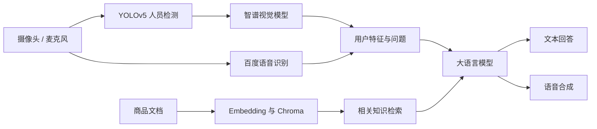

# Sell-RAG

面向智能无人售卖场景的多模态检索增强交互原型，集成人员检测、视觉理解、知识库检索、商品问答、语音交互和桌面界面。

> 本项目为研究与原型代码。仓库仅保存核心源码，不包含模型权重、向量数据库、运行产物或任何真实 API 密钥。

## 项目概览

Sell-RAG 通过摄像头感知用户，结合视觉模型提取图像信息，并使用检索增强生成（Retrieval-Augmented Generation, RAG）从商品资料中检索上下文，最终由大语言模型生成自然语言回答或商品推荐。系统同时支持麦克风输入、语音合成输出和 PyQt5 桌面对话界面。



## 核心功能

- **人员检测**：使用 YOLOv5 对摄像头画面进行实时检测，并在满足阈值条件时截取图像。
- **视觉理解**：调用智谱 AI 视觉模型分析图像内容，为后续对话提供上下文。
- **RAG 问答**：加载 DOCX、PDF 或 XLSX 文档，通过本地 Embedding 模型与 Chroma 建立和查询知识库。
- **商品推荐**：结合检索结果、对话历史和用户问题生成自然语言推荐。
- **语音交互**：通过百度语音接口完成中文语音识别和语音合成。
- **桌面界面**：提供基于 PyQt5 的文本输入、语音输入和知识库选择界面。
- **模块化示例**：`C8` 目录提供数据准备、索引构建、检索优化与生成集成的拆分实现。

## 技术栈

| 模块 | 主要技术 |
| --- | --- |
| 目标检测 | YOLOv5、PyTorch、OpenCV |
| 视觉与对话模型 | 智谱 AI |
| 文档处理 | LangChain、Docx2txt、PyPDF |
| 向量检索 | Chroma、Xiaobu Embedding |
| 语音交互 | 百度语音 API、PyAudio、Pydub |
| 桌面界面 | PyQt5 |
| 扩展示例 | Moonshot API |

## 项目结构

```text
sell-rag/
├── .env.example                         # 环境变量示例
├── .gitignore                           # 模型、密钥及运行产物忽略规则
├── README.md
└── zhipuai_rag/
    ├── main.py                          # PyQt5 对话界面入口
    ├── sell.py                          # 摄像头、视觉分析和语音对话主流程
    ├── detect.py                        # 独立人员检测示例
    ├── audio.py                         # 录音、语音识别与语音合成
    ├── rag.py                           # 文档加载、向量检索与模型问答
    ├── tokenizer.py                     # Xiaobu Embedding 封装
    ├── add_files.py                     # 知识库文件添加工具
    ├── rag_data_preprocessor.py         # RAG 数据预处理
    ├── rag_vector_retriever.py          # RAG 向量检索器
    ├── requirements.txt
    └── C8/                              # 模块化 RAG 实现示例
```

以下内容不会提交到仓库：

```text
sherpa-ncnn/                             # 第三方项目源码
zhipuai_rag/weights/                     # YOLOv5 权重
zhipuai_rag/RAG/                         # Embedding 模型
zhipuai_rag/dataset/chroma_db/           # Chroma 向量数据库
*.pcm、*.wav、截图、缓存及本地文档
```

## 环境要求

- Windows 10/11
- Python 3.9（推荐）
- 摄像头和麦克风（运行完整交互流程时需要）
- 可访问智谱 AI、百度语音等外部服务的网络环境
- NVIDIA GPU 与 CUDA 11.8（可选，用于 GPU 推理）

`requirements.txt` 中的 PyTorch 版本面向 CUDA 11.8。CPU 环境或其他 CUDA 版本请先根据 [PyTorch 官方安装说明](https://pytorch.org/get-started/locally/) 安装匹配的 PyTorch，再安装其余依赖。

## 快速开始

### 1. 克隆仓库

```powershell
git clone https://github.com/Deng50/sell-rag.git
cd sell-rag\zhipuai_rag
```

### 2. 创建虚拟环境

```powershell
python -m venv .venv
.venv\Scripts\Activate.ps1
python -m pip install --upgrade pip
pip install -r requirements.txt
```

安装 `PyAudio` 失败时，需要使用与 Python 版本和系统架构匹配的预编译 wheel，或先安装所需的 PortAudio 开发组件。

### 3. 配置 API 密钥

程序从操作系统环境变量读取凭据，不会自动加载 `.env` 文件。PowerShell 示例：

```powershell
$env:ZHIPUAI_API_KEY="你的智谱 AI API Key"
$env:BAIDU_API_KEY="你的百度语音 API Key"
$env:BAIDU_SECRET_KEY="你的百度语音 Secret Key"
$env:MOONSHOT_API_KEY="你的 Moonshot API Key"
```

| 环境变量 | 用途 | 是否必需 |
| --- | --- | --- |
| `ZHIPUAI_API_KEY` | 主流程中的视觉分析与对话生成 | 主程序必需 |
| `BAIDU_API_KEY` | 百度语音服务身份验证 | 使用语音功能时必需 |
| `BAIDU_SECRET_KEY` | 百度语音服务身份验证 | 使用语音功能时必需 |
| `MOONSHOT_API_KEY` | `C8` 模块化示例 | 仅运行 C8 时必需 |

仓库根目录的 `.env.example` 仅用于展示变量名称，不应填写并提交真实密钥。

### 4. 准备模型与知识库

模型文件体积较大，需要自行下载并放置到以下目录：

```text
zhipuai_rag/
├── weights/
│   └── yolov5s.pt
└── RAG/
    └── xiaobu-embedding-v2/
```

准备商品文档后，可运行 `add_files.py` 或数据预处理脚本构建知识库。Chroma 数据默认写入：

```text
zhipuai_rag/dataset/chroma_db/
```

模型、原始业务文档和生成的向量数据库均已被 `.gitignore` 排除。

## 运行项目

项目当前使用相对路径，执行命令前应确保工作目录为 `zhipuai_rag`。

启动完整的摄像头与语音交互流程：

```powershell
python sell.py
```

启动 PyQt5 桌面对话界面：

```powershell
python main.py
```

仅运行人员检测示例：

```powershell
python detect.py
```

运行模块化 RAG 示例：

```powershell
cd C8
pip install -r requirements.txt
python main.py
```

## 安全与隐私

- 禁止将真实 API 密钥写入源码、`.env.example` 或 Git 提交记录。
- 如果密钥曾进入提交历史，仅删除当前文件中的密钥并不充分；应立即撤销旧密钥，并使用历史清理工具删除相关提交内容。
- 摄像头图像和人物特征分析可能涉及个人隐私，应在取得明确授权并遵守适用法律的前提下使用。
- 生产部署前应补充输入校验、异常处理、访问控制、日志脱敏、自动化测试及服务限流。

## 已知限制

- 部分模块依赖本地模型和既有 Chroma 数据，首次运行前必须准备相关资源。
- 若干脚本使用相对路径，应从 `zhipuai_rag` 目录启动。
- 完整流程依赖摄像头、麦克风、音频驱动以及多个外部 API。
- 当前代码主要用于原型验证，尚未提供统一配置层、安装包或自动化测试。

## 许可证

本项目当前未提供开源许可证。在作者明确添加许可证前，请勿假定该代码可被复制、修改或用于商业分发。
