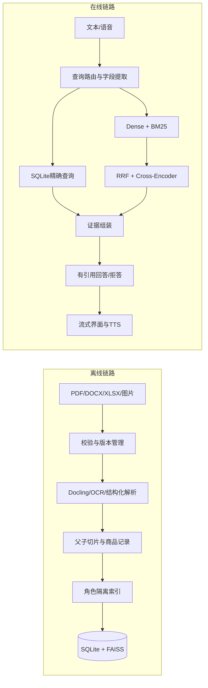

# Sell-RAG

面向单机智能售卖终端的多模态检索增强生成系统。项目将文档版本管理、结构化商品库、混合检索、有引用回答、语音交互和人员存在检测拆分为独立服务，并提供 FastAPI、CLI 与 PyQt 双视图客户端。

> 默认以 Fake 模式运行，不需要 API 密钥或大型模型即可完成开发、演示和自动化测试。生产模式使用智谱生成/视觉、百度 ASR/TTS、本地 BGE Embedding 与 Cross-Encoder。

## Architecture



离线摄取在新索引验证完成后原子切换，因此上传或回滚文档不会让在线问答读取半成品索引。

## Features

- PDF、扫描 PDF、DOCX、XLSX、CSV、JSON、Markdown、文本和图片接入。
- 文件签名、大小、压缩规模与路径安全检查，SHA-256 去重和增量版本管理。
- Docling 优先解析，保留页码、版面、表格和图片元数据；轻量环境自动使用显式回退解析器。
- XLSX 商品行进入 SQLite，价格、库存和 SKU 不依赖向量相似度判断。
- 300/900 Token 父子切片，12% 子块重叠，不跨越商品、章节或表格边界。
- BGE Dense + 中文 BM25 + RRF + Cross-Encoder；模型不可用时降级但不会伪造健康状态。
- `guest`、`operator`、`admin` 角色隔离，文档和结构化商品均执行 ACL。
- 引用白名单校验、无证据拒答、未知商品拒答和提示注入内容隔离。
- 百度 ASR/TTS、WebRTC VAD、热词纠错、低置信确认、分句播放和 barge-in。
- 摄像头仅检测人员是否出现；5/8 帧防抖和 30 秒冷却，不保存画面，不推断身份或人口属性。
- 内置检索、引用、拒答、解析和延迟评测指标。

## Project Layout

```text
configs/default.yaml          运行参数，不保存密钥
src/sell_rag/
├── domain/                   Pydantic 数据契约
├── ingestion/                校验、解析、切片与版本摄取
├── storage/                  SQLite 数据层
├── indexing/                 Embedding、FAISS、BM25 和索引版本
├── retrieval/                路由、过滤、RRF、重排和证据组装
├── generation/               智谱/Fake 适配器与引用回答
├── multimodal/               百度语音、VAD、TTS 和人员存在检测
├── api/                      FastAPI 工厂与版本化接口
├── ui/                       PyQt 用户/管理双视图
├── evaluation/               离线回归评测
├── observability/            JSON 日志与耗时追踪
├── settings.py
└── cli.py
tests/                        单元、集成、夹具与评测数据
runtime/                      文档、SQLite、索引和日志；不提交 Git
```

## Requirements

- Windows 10/11
- Python 3.11
- 完整终端功能需要摄像头和麦克风
- BGE 与 Reranker 使用 GPU 时建议 NVIDIA GPU 及匹配的 PyTorch/CUDA

## Installation

```powershell
git clone https://github.com/Deng50/sell-rag.git
cd sell-rag

py -3.11 -m venv .venv
.venv\Scripts\Activate.ps1
python -m pip install --upgrade pip
pip install -e .
```

按需安装可选能力：

```powershell
pip install -e ".[document,retrieval]"  # Docling、OCR、BGE、FAISS、重排
pip install -e ".[audio,vision,ui]"     # 语音、摄像头、PyQt
pip install -e ".[dev,eval]"            # 测试和评测
```

核心依赖的可复现版本位于 `requirements.lock`：

```powershell
pip install -r requirements.lock
pip install -e . --no-deps
```

PyTorch 应根据设备从官方渠道安装匹配的 CPU 或 CUDA wheel，不在锁文件中强制单一 CUDA 版本。

## Configuration

运行参数位于 `configs/default.yaml`，密钥只从环境变量读取：

```powershell
$env:SELL_RAG_FAKE_PROVIDERS="true"
$env:SELL_RAG_ADMIN_TOKEN="请设置高强度管理员令牌"
$env:SELL_RAG_OPERATOR_TOKEN="请设置操作员令牌"
```

启用真实服务：

```powershell
$env:SELL_RAG_FAKE_PROVIDERS="false"
$env:ZHIPUAI_API_KEY="你的智谱 API Key"
$env:BAIDU_API_KEY="你的百度语音 API Key"
$env:BAIDU_SECRET_KEY="你的百度语音 Secret Key"
$env:SELL_RAG_DEVICE="cuda"
```

## Quick Start

启动本地服务：

```powershell
sell-rag serve
```

访问 API 文档：<http://127.0.0.1:8765/docs>

另开终端启动 PyQt 客户端：

```powershell
sell-rag ui
```

摄取文档并原子重建索引：

```powershell
sell-rag ingest .\data\商品目录.xlsx
sell-rag ingest .\data\校史资料.pdf --acl guest,operator,admin
```

常用管理命令：

```powershell
sell-rag reindex
sell-rag rollback DOCUMENT_ID VERSION
sell-rag migrate-legacy .\zhipuai_rag\dataset\chroma_db
sell-rag evaluate .\tests\fixtures\evaluation.jsonl
```

## API

| Method | Endpoint | Description |
| --- | --- | --- |
| `POST` | `/v1/query` | 同步结构化问答 |
| `POST` | `/v1/query/stream` | SSE 回答、引用与完成事件 |
| `POST` | `/v1/documents` | 上传并异步解析、索引 |
| `GET` | `/v1/documents` | 文档版本、ACL 和状态 |
| `POST` | `/v1/documents/{id}/versions/{version}/activate` | 激活历史版本 |
| `DELETE` | `/v1/documents/{id}` | 软删除并更新索引 |
| `GET` | `/v1/jobs/{id}` | 后台任务状态 |
| `GET/POST` | `/v1/products` | 商品精确查询与维护 |
| `POST` | `/v1/speech/transcribe` | PCM 语音识别 |
| `POST` | `/v1/speech/synthesize` | WAV 语音合成 |
| `POST` | `/v1/feedback` | 用户反馈 |
| `POST` | `/v1/evaluations` | 运行回归评测 |
| `GET` | `/health`, `/ready` | 依赖状态与就绪检查 |

管理请求需要角色和令牌：

```text
X-Role: operator
Authorization: Bearer <SELL_RAG_OPERATOR_TOKEN>
```

请求体中的角色不会用于提权，服务只信任认证头解析出的角色。

## Testing

```powershell
pytest
```

默认测试不访问云 API，也不下载模型。`live` 标记专用于真实服务和模型验证。内置评测集仅用于回归，不能代表真实业务准确率；生产指标必须基于人工标注数据报告。

## Security And Privacy

- `runtime/`、模型、索引、音频、图片和 `.env` 均被 Git 忽略。
- 疑似提示注入内容保留供管理员复核，但默认不进入检索索引。
- 摄像头帧只在内存中处理，不做持久化、人脸识别、年龄、性别或情绪推断。
- 如果密钥曾经进入 Git 历史，应先撤销密钥，再使用历史清理工具处理；删除当前源码中的字符串并不足够。
- 正式部署应使用高强度令牌、限制本机端口访问并保护 `runtime/` 目录权限。

## License

当前仓库尚未提供开源许可证。在作者明确添加许可证前，请勿假定代码可被复制、修改或用于商业分发。
